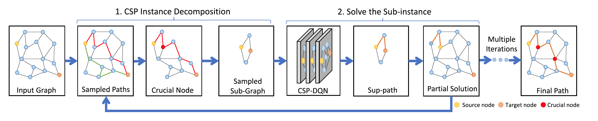

# CSP-GS
This repository contains the official PyTorch implementation of the paper:

> **Learn to Optimize the Constrained Shortest Path on Large Dynamic Graphs**
> *TMC, 2023*
> https://ieeexplore.ieee.org/abstract/document/10076920
---

## Overview

The constrained shortest path (CSP) problem has wide applications in travel path planning, mobile video broadcasting and network routing. Existing works do not work well on large dynamic graphs and suffer from either ineffectiveness or low scalability issues. To overcome these issues, in this paper, we propose an efficient and effective solution framework, namely CSP_GS. The solution framework includes two key components: (1) the techniques to decompose a large CSP instance into multiple small sub-instances and (2) the developed learning model CSP_DQN to solve small CSP instances. The evaluation result on real road network graphs indicates that our approach CSP_GS performs well on large dynamic graphs by rather high quality and reasonable running time, and particularly adapt to significant graph changes even with broken edges. To the best of our knowledge, this is the first learning-based model to well solve the CSP problem on large dynamic graphs.


---


## Training & Evaluation
### Evaluate on Shanghai dataset
```bash
python main.py --dir_path data/map-2030-50-50-1-150-500-new
```

### Evaluate on Koln dataset
```bash
python main.py --dir_path koln_data/koln1630_1.5
```

